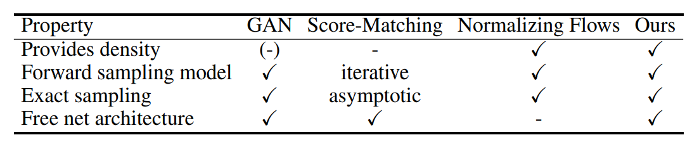
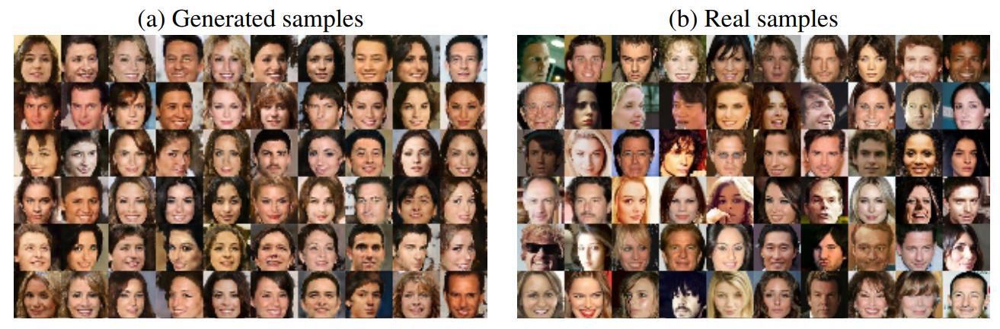

# Tutorial on DDEs using TensorFlow2

This is a brief tutorial on learning Energy-based Generative Models, using denoising density esimators (DDEs):

Article: Learning Generative Models using Denoising Density Estimators ([pdf](https://arxiv.org/abs/2001.02728))
by S. A. Bigdeli, G. Lin, T. Portenier, L. A. Dunbar, M. Zwicker

| Learned real density during training | Learned generated density during training | Real and generated samples |
| --- | --- | --- |
|  |  |  |

Energy-based Generative Models use density representations of both real and generated data samples to compute their KL-divergence.
Given that the optimization only requires the gradients of the KL-divergence loss, the densities do not need to be normalized.
This gives the opportunity to use energy models that are not normalized (e.g. DDEs), but are very efficient in training and inference.
Table below summarizes the benefits of these models compared to other techniques:

 

The code example uses Tensorflow 2, numpy, and matplotlib (for visualizaiton)

## Demo files
- [egm_dde.ipynb](https://github.com/siavashBigdeli/EGM-DDE/blob/master/egm_dde.ipynb): is a jupyter notebook with TF code to train DDEs
- [energy_models.py](https://github.com/siavashBigdeli/EGM-DDE/blob/master/energy_models.py): is a python file with DDE class implementation
- [utils.py](https://github.com/siavashBigdeli/EGM-DDE/blob/master/utils.py): is a python file with helper functions to generate samples from toy 2D distributions
- Geng's [repository](https://github.com/logchan/dde) includes code on density estimation bench mark and generative model training examples for MNIST and CelebA.

## Generative modeling results
Generated results on 32 × 32 images from the celebA dataset using DDEs. (See Geng's repositor for its implementation)

 

### License
 This work is licensed under a <a rel="license" href="http://creativecommons.org/licenses/by-nc-sa/4.0/">Creative Commons Attribution-NonCommercial-ShareAlike 4.0 International License</a>.
